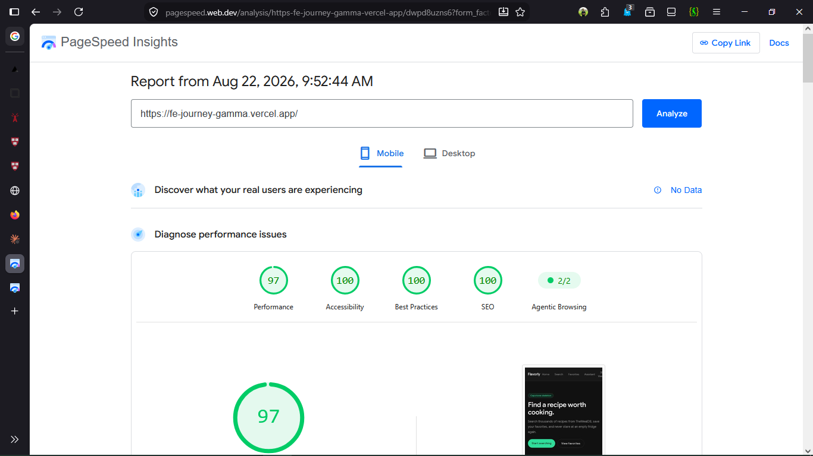
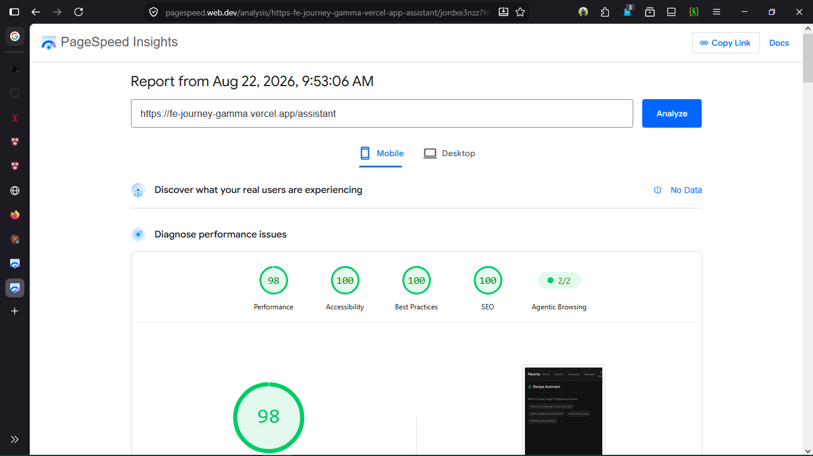

# AUDIT.md — FE-10 Accessibility & Performance Audit

## Pages audited

| Page | URL |
|------|-----|
| Home | `/` |
| Search | `/search` |
| Assistant (primary flow) | `/assistant` |
| Recipe detail | `/recipe/[id]` |

---

## Baseline — BEFORE scores (Lighthouse mobile, throttled 4G)

> Run Lighthouse in Chrome DevTools → Lighthouse tab → Mobile preset →
> Analyze page load. Take a screenshot of the score panel for `/` and
> `/assistant` and replace the placeholders below.

### Home `/`

<!-- BEFORE: replace with your Lighthouse screenshot -->

### Assistant `/assistant`

<!-- BEFORE: replace with your Lighthouse screenshot -->

---

## Issues found

### Accessibility

#### A1 — No skip-to-content link
**Impact:** High. Keyboard users must tab through all 6 nav links on every
page before reaching main content.
**Fix:** Added a visually-hidden `<a href="#main-content">` as the first
focusable element in `layout.tsx`. Visible only on focus. `id="main-content"`
added to the `<main>` element.

#### A2 — `<nav>` missing `aria-label`
**Impact:** Medium. Without a label, screen readers announce "navigation" with
no context. If a second nav landmark is added later, users can't distinguish them.
**Fix:** Added `aria-label="Main navigation"` to the `<nav>` in `nav-bar.tsx`.

#### A3 — Active nav link has no `aria-current`
**Impact:** Medium. Screen reader users can't tell which page they are on from
the navigation.
**Fix:** Extracted nav links into a client `NavLink` component that reads
`usePathname()` and sets `aria-current="page"` on the matching link. Active
links also receive `font-medium text-foreground` to provide a visual signal.

#### A4 — Streaming AI output not announced by assistive technology
**Impact:** High (AI-specific). The chat area had no `aria-live` region. Screen
reader users heard nothing when the assistant responded.
**Fix 1:** Changed the message scroll container to `role="log"`. The `log` role
implies `aria-live="polite"` and `aria-relevant="additions"` — new message
bubbles are announced when they appear; per-character streaming changes inside
an existing bubble are not re-announced (avoids queue flooding).
**Fix 2:** Added a visually-hidden `<StatusAnnouncer>` component that fires
`role="status"` once when streaming completes, reading the first 160 characters
of the completed response.

#### A5 — Chat input missing accessible label
**Impact:** High. The `<input>` had `placeholder="Ask about a recipe…"` but no
`<label>` or `aria-label`. Placeholder text is not reliably announced by all
screen reader / browser combinations, and disappears when the user types.
**Fix:** Added `<label htmlFor="chat-input" className="sr-only">Ask about a
recipe</label>` paired with `id="chat-input"` on the input.

#### A6 — Error panel missing `role="alert"`
**Impact:** High. The chat-level error state (`Response failed`) rendered
silently — no announcement triggered.
**Fix:** Added `role="alert"` to the error panel `
`. `alert` implies
`aria-live="assertive"` so the error is announced immediately, interrupting
any current AT output (appropriate for errors).

#### A7 — Thinking indicator invisible to AT
**Impact:** Medium. The animated bounce dots communicated "loading" visually
but had no accessible text. Screen reader users heard nothing during the
wait for a response.
**Fix:** Added `role="status"` and `aria-label="Flavorly is thinking"` to the
thinking indicator wrapper. The dot `` elements are marked
`aria-hidden="true"` since they are purely decorative.

#### A8 — Search input missing label
**Impact:** Medium. `<input type="text">` on the Search page had no `<label>`
or `aria-label`.
**Fix:** Changed to `type="search"` (correct semantic type; gives mobile users
a Search keyboard key) and added `aria-label="Search recipes"`.

#### A9 — Decorative icons not hidden from AT
**Impact:** Low. Lucide icons rendered next to labelled text (e.g. the `ChefHat`
next to "Recipe Assistant") are read aloud by some screen readers, creating
redundant noise.
**Fix:** Added `aria-hidden="true"` to all purely decorative icon instances
in `app/assistant/page.tsx`.

#### A10 — Prompt chips group not labelled
**Impact:** Low. The chip buttons are individually labelled (their text is the
label), but the group had no context indicating they are suggested prompts.
**Fix:** Added `role="group"` + `aria-label="Suggested prompts"` to the chip
container.

---

### Performance

#### P1 — Three.js / R3F bundle (already mitigated)
The `@react-three/fiber` chunk (~480 KB gzip) is excluded from all non-3D
routes via `next/dynamic` with `ssr: false`. Confirmed: no Three.js in the
`/`, `/search`, or `/assistant` bundles.

#### P2 — `next/image` sizes (already correct)
`RecipeToolResult` uses `sizes="(max-width: 640px) 50vw, 33vw"` which matches
the 2-column mobile / 3-column desktop grid. No changes needed.

#### P3 — Font loading (already optimal)
`Google_Sans` loaded via `next/font/google` which inlines the font-face CSS and
preloads the WOFF2 file. `font-display: swap` is applied automatically.

#### P4 — No render-blocking resources found
All CSS is inlined by Next.js build. No external stylesheets or synchronous
scripts.

---

## Changes summary

| File | Change |
|------|--------|
| `app/layout.tsx` | Skip-to-main link; `id="main-content"` on `<main>` |
| `components/nav-link.tsx` | New client component; `aria-current="page"` via `usePathname` |
| `components/nav-bar.tsx` | `aria-label="Main navigation"` on `<nav>`; use `NavLink` |
| `app/assistant/page.tsx` | `role="log"` on message area; `StatusAnnouncer`; `role="alert"` on error; `role="status"` + `aria-label` on thinking indicator; `<label>` for input; `aria-hidden` on icons; prompt chip group label |
| `app/search/page.tsx` | `type="search"`; `aria-label="Search recipes"` |

---

## After — AFTER scores (Lighthouse mobile, post-fix deployment)

> After Vercel deploys the fixes, run Lighthouse again on the same pages and
> replace the placeholders below.

### Home `/`

<!-- AFTER: replace with your Lighthouse screenshot -->

### Assistant `/assistant`

<!-- AFTER: replace with your Lighthouse screenshot -->

---

## Keyboard walk-through — primary flow

Tested with keyboard only (Tab / Shift-Tab / Enter / Space):

1. **Load `/`** → Tab → "Skip to main content" focus ring appears → Enter → focus jumps to `<main>`
2. **Tab through nav** → each link receives visible green ring (`focus-visible:ring-2 focus-visible:ring-accent`) → active page shows `aria-current="page"`
3. **Navigate to `/assistant`** → Tab into input → type query → Enter to submit
4. **While streaming** → Stop button is tab-reachable (`h-10 w-10` target, visible ring)
5. **On error** → `role="alert"` announces immediately → Tab to Retry button → Enter
6. **Prompt chips** → Tab into each chip → Enter fills input

All interactive elements are reachable and operable by keyboard alone.

---

## WAVE results (run WAVE extension on `/` and `/assistant` after fixes)

Expected: 0 errors, 0 contrast errors.
Alerts (non-errors) to justify:
- **`aria-hidden` on icons** — intentional; icons are decorative beside labelled text
- **Redundant link** — "Flavorly" logo and "Home" nav link both go to `/`; acceptable pattern
